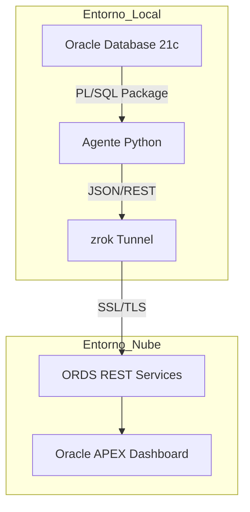

# 🗳️ Sistema de Monitoreo Electoral (E2E)
> **Arquitectura Híbrida:** Oracle DB ➡️ Python ➡️ Zrok Tunnel ➡️ Oracle APEX Cloud

## 📝 Descripción del Proyecto
Este ecosistema permite la captura de datos electorales desde una base de datos local y su transmisión segura hacia un Dashboard en la nube de **Oracle APEX**. Utiliza un agente de **Python** para la orquestación y **zrok** para superar barreras de red.

## 🏗️ Arquitectura del Sistema

